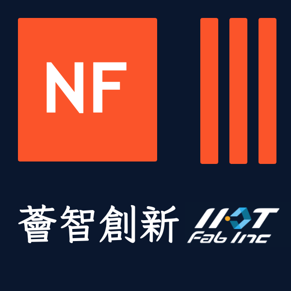

#  NeurForge 薈智神鑄

**鑄造會思考的工廠**

> Agent 平台 × 企業資料飛輪 × 工業場景應用

<p align="center">
| <a href="README.md"><b>English</b></a>
| <a href="README_JA.md"><b>日本語</b></a>
| <a href="https://github.com/AaronHung/neurforge"><b>GitHub</b></a>
|
</p>

---

NeurForge 是**為智慧製造打造的 Agent 開發平台**。不是聊天介面，而是讓工廠的資料、SOP 與現場經驗，鑄造成越用越強的 Agent 系統。

以 [OpenAI Agents SDK](https://github.com/openai/openai-agents-python) 為底座，NeurForge 疊加製造專屬的 Harness、Memory、多 Agent 協作與資料飛輪，讓 Agent 真正從 demo 走向可上線的工業執行層。

---

## 問題

工廠現場的三個結構性痛點：

| # | 痛點 | 影響 |
|---|------|------|
| 1 | **老師傅的經驗沒有被留下來** — 瑕疵判讀、異音、故障徵兆多半靠資深人員的直覺與口頭傳承。退休或輪調後，知識隨之流失。 | 新人訓練週期長、品質波動大 |
| 2 | **資料散落在各個系統** — PdM、MES、SCADA、巡檢表、工單、品檢記錄分布在不同系統。現場人員要同時開五六個畫面才能拼出全貌，跨系統問題幾乎無法自動回答。 | 資訊孤島、決策延遲 |
| 3 | **AI 專案做一個耗半年，做完就定型** — 每次換產線、換機型、換缺陷類型，就要重新標註、重新訓練、重新部署。投入成本高、調整速度慢。 | AI 投入不會複利累積 |

**結果：** AI 投入不少，落地不穩；知識年年流失，工廠越來越難複製優秀產線的經驗。

---

## 三層產品架構

```
L3 · 應用層     工廠巡檢 Agent · 質量檢查 Agent · 異常調查工作台 · 預測維護
                ─────────────────────────────────────────────────────────────
L2 · 平台層     Agent Builder · Tool Registry & Synthesis
                Orchestration / Guardrails · Memory / Multi-Agent
                ─────────────────────────────────────────────────────────────
L1 · 資料層     企業資料飛輪
                (SOP · 工單 · 巡檢結果 · SCADA/MES · 感測器訊號 · 影像)
```

建構於 OpenAI Agents SDK 之上，NeurForge 聚焦製造現場的資料接軌、流程編排、記憶累積與多角色協作，形成不可輕易複製的垂直能力。

---

## 平台核心能力

| 能力 | 說明 |
|------|------|
| **Tool Registry & 工具合成** | 工具定義一次，跨 Agent 重用。可從描述自動合成工具程式碼。 |
| **流程編排與 Guardrails** | 多步 workflow 支援人工審批節點、timeout、重試與降級保護。 |
| **Memory 與案例沉澱** | 現場案例、專家修正與 SOP 執行結果累積為企業專屬記憶，供後續 Agent 查詢與重用。 |
| **多 Agent 協作** | Planner → Inspector → Analyst → Reporter 角色分工，處理複雜任務。 |
| **多模態理解** | 文字、影像（瑕疵照片、熱像、CCTV）、語音（異音）、時序資料由同一套 Agent 流程共同處理。 |
| **Evidence Path** | 每個 Agent 結論保留完整 tool trace 與證據鏈，可回溯、可稽核。 |
| **系統接軌** | 串接 MES、SCADA、PLC、文件庫、工單系統與視覺管線。 |

---

## 智慧製造 Agent 應用

### App 01 — 工廠巡檢 Agent
- 多模態巡檢：影像、儀表讀值、語音備註
- 異常自動生成工單與建議處置
- 巡檢結果回灌案例庫，越用越準
- **預期效益：** 單班巡檢時間 2 小時 → 25 分鐘

### App 02 — 質量檢查 Agent
- 跨原料、製程、成品的一條龍追溯
- 比對相似案例與歷史處置紀錄
- 串接工單、SOP、品質文件，加速初步判讀
- **預期效益：** 品質事件初步判讀：日級 → 小時級

### App 03 — 客製化視覺 Agent（共創擴展）
- 導入客戶指定影像、缺陷知識與場域案例
- 從單站點 / 單缺陷類型開始快速迭代
- 可延伸到表面缺陷、組裝異常、外觀異常

---

## NeurForge 飛輪

每用一次，系統就更懂你的現場：

```
1. 接入現場資料      →  文件、設備、照片、工單
2. 整理成可用知識    →  故障知識圖譜、案例庫、可執行 SOP
3. 協助判斷          →  有案例依據的可解釋建議與證據
4. 執行流程          →  派工、回報、追蹤、升級處理
5. 人工修正回饋      →  現場人員確認、補充與修正
6. 沉澱成企業記憶    →  案例與經驗留給下一次重用
      └──────────────────────────────────────┘
                   飛輪持續增強 →
```

**三個核心價值：** 更快回應 · 降低資訊遺漏 · 知識留在組織裡不流失。

---

## 快速上手

> 需要 Python 3.12+ 與 [uv](https://github.com/astral-sh/uv)。

```bash
git clone https://github.com/AaronHung/neurforge.git
cd neurforge
uv sync
cp .env.example .env
# 編輯 .env：填入 NEURFORGE_LLM_API_KEY 與相關設定
```

執行基本對話（無工具）：

```bash
python scripts/cli_chat.py --config simple/base
```

執行含網路搜尋的對話：

```bash
# 需在 .env 設定 SERPER_API_KEY 與 JINA_API_KEY
python scripts/cli_chat.py --config simple/base_search
```

啟動 Web UI：

```bash
python examples/svg_generator/main_web.py
# 開啟 http://127.0.0.1:8848
```

`.env` LLM 設定範例：

```bash
NEURFORGE_LLM_TYPE=chat.completions
NEURFORGE_LLM_MODEL=deepseek-chat
NEURFORGE_LLM_BASE_URL=https://api.deepseek.com/v1
NEURFORGE_LLM_API_KEY=your-api-key
```

---

## 致謝

NeurForge 基於 Tencent Youtu Lab 的 [youtu-agent](https://github.com/TencentCloudADP/youtu-agent)（MIT 授權）fork 而來，在保留完整 upstream 致謝的基礎上，疊加製造專屬能力。

本專案同時使用：
- [openai-agents](https://github.com/openai/openai-agents-python)
- [mkdocs-material](https://github.com/squidfunk/mkdocs-material)
- [model-context-protocol](https://github.com/modelcontextprotocol/python-sdk)

---

*NeurForge · 為智慧製造打造的 Agent 開發平台*
