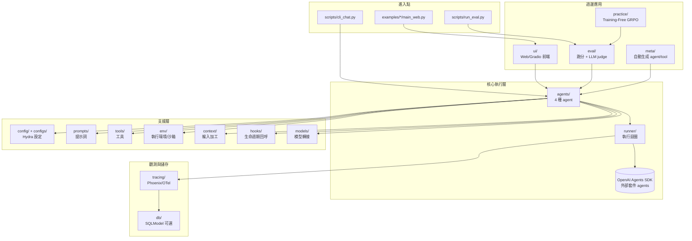
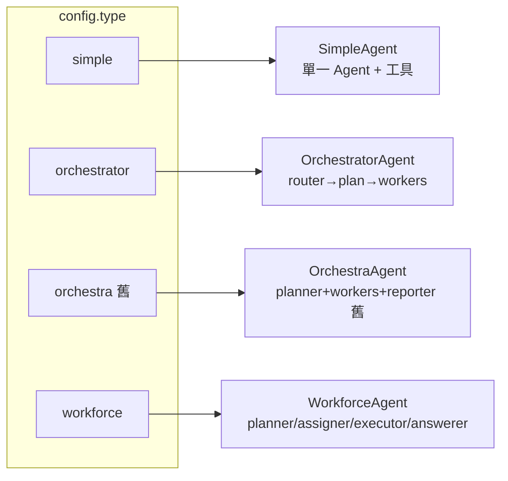
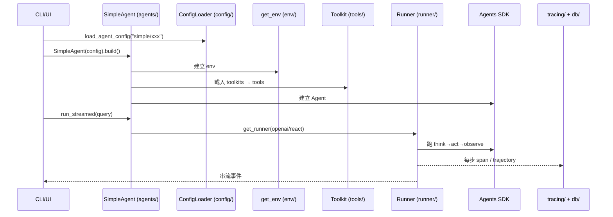

# NeurForge 程式碼結構總覽（pgm-docs）

> 目的：把 `utu/` 底下每個目錄「是什麼、做什麼、怎麼用、用到什麼技術」一次講清楚，
> 當作教育訓練教材的底層地圖。讀完這份，再讀
> [SVG Generator 技術流](../pgm-spec/svg_generator_techflow.zh-TW.md) 會更有體感。
>
> 語言：zh-TW；英文技術名詞保留原文。
> 前提：真實程式碼都在 `utu/`，`neurforge/` 只是 forwarding shim（`neurforge.X == utu.X`）。

---

## 0. 一張圖看懂分層



**心智模型**：`agents/` 是大腦，`runner/` 是它的執行迴圈，底層引擎是外部套件
**OpenAI Agents SDK**（package 名 `agents`）。其餘目錄都是圍繞著「怎麼設定、給什麼
工具、在什麼環境跑、怎麼觀測、怎麼評分、怎麼自動生成」的支援角色。

---

## 1. 先回答你的幾個直接問題

### 1.1 `db/` 我沒裝 SQL，怎麼回事？

**DB 是「可選」的，沒設定就自動跳過，完全不影響跑 agent。**
邏輯在 [utu/utils/sqlmodel_utils.py](../../utu/utils/sqlmodel_utils.py)：

```python
def check_db_available(cls, ...):
    if not EnvUtils.get_env("UTU_DB_URL", ""):   # 沒設連線字串
        cls._db_available = False
        return False                              # → DB 不可用
    ...
```

而 [utu/db/db_service.py](../../utu/db/db_service.py) 的每個操作都包在
`@require_db(safe=True)`：DB 不可用就「安靜略過、回傳 None/False」，不報錯。

- 用的是 **SQLModel**（SQLAlchemy + Pydantic），不是綁死某個資料庫。
- `UTU_DB_URL`（或 `NEURFORGE_DB_URL`）可指向 **SQLite 檔案**（不需安裝伺服器）或
  PostgreSQL/MySQL。
- 首次連線會自動 `create_all` 建表（`_init_db_schema`）。
- 存什麼：trajectory（執行軌跡）、tool cache、eval 樣本、tracing。
- 結論：**你不需要為了跑 demo 裝任何 SQL**；要長期保存軌跡/做 eval 才設 `UTU_DB_URL`。

### 1.2 `eval` 不是有 critic 嗎？為什麼之前說「沒有 critic」？

兩件事，要分清楚層級：

| | runtime（跑 agent 時） | eval（離線跑分時） |
| --- | --- | --- |
| 有沒有「評審」 | **沒有**：orchestrator 跑完就回答，不自我評分、不重試 | **有**：LLM-as-judge 評對錯給 reward |
| 在哪 | `agents/`、`runner/` | [utu/eval/processer/base_llm_processor.py](../../utu/eval/processer/base_llm_processor.py) |
| 證據 | `_run_task` 後沒有 validator | `judge_one()` 呼叫 `judge_client` 比對標準答案 |

所以我之前說「沒有 critic」是指**SVG 執行流程裡沒有自我修正/重試的 critic**——這仍然正確。
但 `eval/` 確實有一個 **judge（評審模型）**，它的工作是「拿 agent 答案 vs 標準答案，判對錯、
算 pass@k」，用於 benchmark 跑分，**不是**在使用者對話當下介入。判分提示詞在
[utu/prompts/eval/judge_templates.yaml](../../utu/prompts/eval/judge_templates.yaml)。

```python
# base_llm_processor.py：判分核心
async def judge_one(self, data):
    if self._extract_exact_answer(response) == correct_answer:
        data.update(correct=True, reward=1.0)        # 完全相同 → 直接過
        return data
    content = await self.judge_client.query_one(...)  # 否則叫 LLM 當裁判
    data.update(**self._parse_judge_response(content))# 解析 correct: yes/no
```

> 教學重點：**「judge（評分）」≠「critic（執行中自我修正）」**。本 repo 有前者（離線
> eval），沒有後者（runtime 自我修正）。若要做 runtime critic，得在 `_run_task` 後加
> 「驗證→不滿意則 replan/重跑」的迴圈，目前尚未實作。

### 1.3 OpenAI Agents SDK 在哪？怎麼用？

- 它是**外部 pip 套件**，import 名稱叫 `agents`（`openai-agents`），不在本 repo 內。
- NeurForge **不自己寫 LLM 迴圈**，而是包這個 SDK。核心接點：

| SDK 物件 | 在哪被用 | 作用 |
| --- | --- | --- |
| `Agent` | [simple_agent.py](../../utu/agents/simple_agent.py) `build()` | 一個 agent（instructions+model+tools） |
| `Runner` / `AgentRunner` | [runner/\_\_init\_\_.py](../../utu/runner/__init__.py) | 預設執行迴圈（`run`/`run_streamed`） |
| `function_tool` | [tools/base.py](../../utu/tools/base.py) `get_tools_in_agents()` | 把 Python 方法轉成 SDK 工具 |
| `trace` | 各 agent `_start_streaming` | 包一段可觀測的 trace |
| `RunHooks` | [hooks/base_hooks.py](../../utu/hooks/base_hooks.py) | 生命週期回呼 |
| `StopAtTools` | simple_agent.py | 呼叫某工具後即停 |

兩種 runner（`config.runner` 切換，見 [agent_config.py](../../utu/config/agent_config.py)）：
- `"openai"`：直接用 SDK 的 `AgentRunner`（預設）。
- `"react"`：[utu/runner/react_runner.py](../../utu/runner/react_runner.py)，NeurForge
  **複刻並客製** SDK 的 streaming 迴圈（think→act→observe），多了 max-turns 處理等彈性。
  它仍大量複用 SDK 內部元件（`RunImpl`、`agent_span`…），只是把主迴圈攤開可改。

---

## 2. 目錄逐一說明（`utu/` 下）

下表先速覽，後面分組細講。

| 目錄 | 一句話 | 關鍵技術 |
| --- | --- | --- |
| `agents/` | 4 種 agent（simple/orchestrator/orchestra/workforce） | OpenAI Agents SDK |
| `runner/` | agent 執行迴圈（openai / react） | Agents SDK Runner |
| `config/` | 把 YAML 載入成 typed config 物件 | Hydra + Pydantic |
| `prompts/` | 所有提示詞模板（YAML + Jinja2） | Jinja2 |
| `tools/` | 內建工具與 toolkit 基底 | `@register_tool`, MCP |
| `env/` | agent 的執行環境/沙箱 | local / E2B / docker / sandbox |
| `context/` | 送進 LLM 前對輸入加工 | 自訂 |
| `hooks/` | 執行生命週期回呼（log/token 統計） | Agents SDK RunHooks |
| `models/` | 模型層轉接（ReAct chat-completions） | OpenAI SDK |
| `tracing/` | 可觀測性（Phoenix/OTel）+ DB tracer | OpenInference/OTel |
| `db/` | 軌跡/快取/eval 資料儲存（可選） | SQLModel |
| `ui/` | Web/Gradio 前端後端 | Tornado WebSocket |
| `eval/` | benchmark 跑分 + LLM judge | LLM-as-judge |
| `practice/` | Training-Free GRPO 經驗強化 | 自研演算法 |
| `meta/` | 自動生成 agent / tool 設定 | 多步 agent |
| `utils/` | 共用工具（env/log/openai client…） | — |
| `data/` | 內建資料（如 planner few-shot 範例） | — |

---

### 2.1 核心執行：`agents/`、`runner/`、`models/`、`hooks/`、`context/`

**`agents/`** — 平台的大腦。四種 agent，由
[utu/agents/\_\_init\_\_.py](../../utu/agents/__init__.py) 的 `get_agent()` 依 `type` 建立：



- `simple_agent.py`：最常用，封裝 SDK `Agent`+`Runner`，管 tools/env/context/mcp。
- `orchestrator/` + `orchestrator_agent.py`：現行多代理（router + ChainPlanner + workers）。
  詳見 [SVG 技術流](../pgm-spec/svg_generator_techflow.zh-TW.md)。
- `orchestra/` + `orchestra_agent.py`：**舊版多代理**（planner + workers + reporter），
  已 deprecated，UI 還保留相容但建議用 orchestrator。
- `workforce/` + `workforce_agent.py`：另一條多代理路線（planner/assigner/executor/answerer
  分工），實驗性。
- `llm_agent.py`：最薄的一層 LLM 呼叫封裝（planner 內部會用）。

> 為什麼有三套多代理（orchestra / orchestrator / workforce）？這是 fork 自 youtu-agent
> 的歷史演進：orchestra 最早 → orchestrator 是改良主線 → workforce 是另一種分工實驗。
> **教學/demo 一律用 `orchestrator`。**

**`runner/`** — 見 §1.3。`filters.py` 內的 `utu_input_filter` 是送進模型前的 input
過濾（例如 token 預算控制），由 `SimpleAgent._get_run_config()` 掛上。

**`models/`** — 模型層轉接。`react.py` 的 `ReactModel` 繼承 SDK 的
`OpenAIChatCompletionsModel`，把 ReAct 風格的串流輸出轉成 SDK 能消費的事件；
搭配 `runner=react` 使用。一般用預設模型即可，不必碰這層。

**`hooks/`** — `BaseRunHooks` 實作 SDK 的 `RunHooks` 介面，在
`on_tool_start/on_tool_end/on_llm_end` 等時點做 logging 與 token 統計（寫進 context 供
input filter 控預算）。要加「每次工具呼叫做 X」就改這裡。

**`context/`** — `BaseContextManager.preprocess()` 在每輪送進 LLM 前對輸入動手腳。
內建 `DummyContextManager`：當 `current_turn == max_turns` 時注入「不要再用工具、直接給
最終答案」訊息，避免無限繞圈。`env_context_manager.py` 則把 env 狀態/skills 注入提示。

---

### 2.2 設定與提示：`config/`、`prompts/`、`data/`

**`config/`** — 把 `configs/*.yaml` 載入成 typed 物件。核心是
[utu/config/loader.py](../../utu/config/loader.py) 的 `ConfigLoader`，用 **Hydra**
`compose` 解析 `defaults` 組裝，再丟進 **Pydantic** model 做型別驗證。

- `agent_config.py`：`AgentConfig`（含四種 agent 的所有欄位）、`ToolkitConfig`、`EnvConfig`…
- `model_config.py`：`ModelConfigs`（model_provider / model_settings / model_params）。
- `eval_config.py`、`practice_config.py`：eval / GRPO 用。

對應磁碟上的 YAML 在 repo 根的 `configs/`（不是 `utu/config/`）：
`configs/agents/`（agent）、`configs/model/`（模型）、`configs/tools/`（工具）、
`configs/eval/`、`configs/practice/`。**「程式碼讀設定」在 `utu/config/`；「設定內容」在
`configs/`。**

**`prompts/`** — 所有提示詞，YAML 存、Jinja2 渲染（`FileUtils.load_prompts` +
`get_jinja_template_str`）。子目錄對應用途：`agents/`（如
`agents/orchestrator/chain.yaml` 的 planner/worker prompt）、`eval/`（judge 模板）、
`meta/`、`practice/`、`tools/`。**改 agent 行為優先改 prompt，不必改 Python。**

**`data/`** — 內建靜態資料。例如 `data/plan_examples/chain.json` 是 planner 的 few-shot
範例（`ChainPlanner` 載入它教 LLM 怎麼產 plan）。

---

### 2.3 工具與環境：`tools/`、`env/`

**`tools/`** — agent 能呼叫的工具。基底是
[utu/tools/base.py](../../utu/tools/base.py) 的 `AsyncBaseToolkit`：

- 用 `@register_tool`（`tools/utils.py`）標記方法 → `tools_map` 自動收集（靠
  `_is_tool` 屬性）。**不要用 SDK 的 `@function_tool` 直接標方法**，那不會被 toolkit 收。
- `get_tools_in_agents()` 才把這些方法用 SDK 的 `function_tool` 包成可用工具。
- 同一份工具能輸出三種格式：Agents（`get_tools_in_agents`）、OpenAI（`get_tools_in_openai`）、
  MCP（`get_tools_in_mcp`）——這是日後接 MCP 的基礎。
- 內建工具：search、python_executor、bash、document、image、audio、video、github、
  wikipedia、arxiv、memory、tabular_data、thinking、user_interaction… 一檔一 toolkit。

工具載入模式（`ToolkitConfig.mode`）：
- `builtin`：用 `TOOLKIT_MAP` 的內建 toolkit。
- `customized`：指定 `customized_filepath` + `customized_classname`，從檔案動態載入
  （三個 Smart Manufacturing agent 就是這樣掛自家工具，不必改 `tools/__init__.py`）。
- `mcp`：連外部 MCP server（`stdio`/`sse`/`streamable_http`）。

**`env/`** — agent 跑在什麼「世界」。`base_env.py` 定義介面（`get_tools`/`get_state`/
`get_extra_sp`）；`get_env()`（[utu/env/\_\_init\_\_.py](../../utu/env/__init__.py)）依
`config.env.name` 選實作：

| env | 用途 |
| --- | --- |
| `base` | 預設，無特殊環境（SVG/多數 simple agent 用這個） |
| `shell_local` | 本機 shell + skills |
| `e2b` / `browser_e2b` | E2B 雲端沙箱（安全執行程式碼/瀏覽器） |
| `browser_docker` / `browser_tione` | 容器化瀏覽器 |
| `sandbox` / `swerex` | 沙箱 / SWE 任務環境 |

env 可提供額外工具與系統提示，讓 agent 真的能「動手做事」（執行程式、開瀏覽器）。

---

### 2.4 觀測與儲存：`tracing/`、`db/`

**`tracing/`** — 可觀測性。`setup.py` 用 **OpenInference** instrumentor 把 Agents SDK
每步轉 OTel span，經 OTLP 送 **Phoenix**；`db_tracer.py` 另把軌跡寫 DB。沒設
`PHOENIX_ENDPOINT`/`PHOENIX_PROJECT_NAME` 就自動關閉，不影響執行。
（細節見 SVG 技術流 §5.3。）

**`db/`** — 見 §1.1。SQLModel 模型：`trajectory_model`（執行軌跡）、`tracing_model`、
`tool_cache_model`（工具結果快取）、`eval_datapoint`、`experience_cache_model`（GRPO 經驗）。
全部可選，沒 `UTU_DB_URL` 就略過。

---

### 2.5 週邊應用：`ui/`、`eval/`、`practice/`、`meta/`

**`ui/`** — 前端後端。`webui_agents.py`（Tornado WebSocket，主力）把 agent 串流事件轉成
前端事件；`gradio_chatbot.py`/`dummy_chatbot.py` 是替代/測試前端。前端靜態檔來自
`neurforge_agent_ui` wheel（由 `frontend/` 建置）。

**`eval/`** — benchmark 跑分。`processer/` 各檔對應一個 benchmark（gaia/xbench/browse_comp/
web_walker/swe_bench…），共同基底 `base_llm_processor.py` 提供 LLM-as-judge（§1.2）。
入口 `scripts/run_eval.py`。`benchmarks/` 放 benchmark 載入邏輯，`data/` 放樣本資料結構。

**`practice/`** — Training-Free GRPO（見
[utu/practice/README.md](../../utu/practice/README.md)）。不更新模型參數，靠「rollout →
verify 給 reward → 萃取經驗 → 回灌 prompt」迭代強化 agent。會用到 `eval/` 的 verify/judge 與
`db/` 存經驗。屬進階研究功能，demo 不需要。

**`meta/`** — 自動生成。`simple_agent_generator.py`：用一串子 agent（clarification →
tool_selection → instructions_generation → name_generation）幫你「對話式產生一個新的
simple agent YAML」，存到 `configs/agents/generated/`。`tool_generator_mcp.py`：協助生成
MCP 工具。Web UI 的「新增 agent」就是走這條。

**`utils/`** — 共用工具。重點：`env.py`（`EnvUtils` 讀環境變數）、`log.py`（logger）、
`openai_utils/`（`SimplifiedAsyncOpenAI` 輕量 OpenAI client，eval judge 用它）、
`sqlmodel_utils.py`（DB 連線）、`agents_utils.py`（trace_id、串流列印、trajectory 抽取）、
`path.py`（`DIR_ROOT` 等路徑）、`mcp_utils.py`、`tool_cache.py`。

---

## 3. 兩條最常見的執行路徑（把目錄串起來）

### 3.1 跑一個 simple agent（單代理）



### 3.2 跑 orchestrator（多代理，SVG Generator）

見專文：[SVG Generator 技術流](../pgm-spec/svg_generator_techflow.zh-TW.md)。
一句話：`router → ChainPlanner 產生 Task 串列 → 逐一呼叫 SimpleAgent worker → 最後一步輸出當答案`。

---

## 4. 教學時的「目錄優先級」建議

| 階段 | 必講 | 可略過 |
| --- | --- | --- |
| 入門 | `agents/`(simple)、`config/`+`configs/`、`prompts/`、`tools/` | practice、workforce、orchestra |
| 進階 | `agents/`(orchestrator)、`runner/`、`env/`、`tracing/` | models 細節 |
| 平台/維運 | `ui/`、`db/`、`eval/`、`meta/` | — |
| 研究 | `practice/`、`eval/` judge、`models/` | — |

---

### 附錄：本文引用的關鍵檔案

| 主題 | 檔案 |
| --- | --- |
| agent 派工 | [utu/agents/\_\_init\_\_.py](../../utu/agents/__init__.py) |
| SimpleAgent | [utu/agents/simple_agent.py](../../utu/agents/simple_agent.py) |
| runner 選擇 | [utu/runner/\_\_init\_\_.py](../../utu/runner/__init__.py) |
| 自訂 ReAct 迴圈 | [utu/runner/react_runner.py](../../utu/runner/react_runner.py) |
| config 載入 | [utu/config/loader.py](../../utu/config/loader.py) |
| config 結構 | [utu/config/agent_config.py](../../utu/config/agent_config.py) |
| toolkit 基底 | [utu/tools/base.py](../../utu/tools/base.py) |
| env 工廠 | [utu/env/\_\_init\_\_.py](../../utu/env/__init__.py) |
| hooks | [utu/hooks/base_hooks.py](../../utu/hooks/base_hooks.py) |
| context | [utu/context/base_context_manager.py](../../utu/context/base_context_manager.py) |
| DB 服務 | [utu/db/db_service.py](../../utu/db/db_service.py) |
| DB 可用性 | [utu/utils/sqlmodel_utils.py](../../utu/utils/sqlmodel_utils.py) |
| tracing | [utu/tracing/setup.py](../../utu/tracing/setup.py) |
| eval LLM judge | [utu/eval/processer/base_llm_processor.py](../../utu/eval/processer/base_llm_processor.py) |
| practice 說明 | [utu/practice/README.md](../../utu/practice/README.md) |
| 自動生成 agent | [utu/meta/simple_agent_generator.py](../../utu/meta/simple_agent_generator.py) |
| Web UI 後端 | [utu/ui/webui_agents.py](../../utu/ui/webui_agents.py) |
