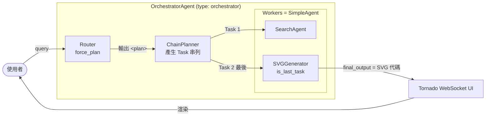
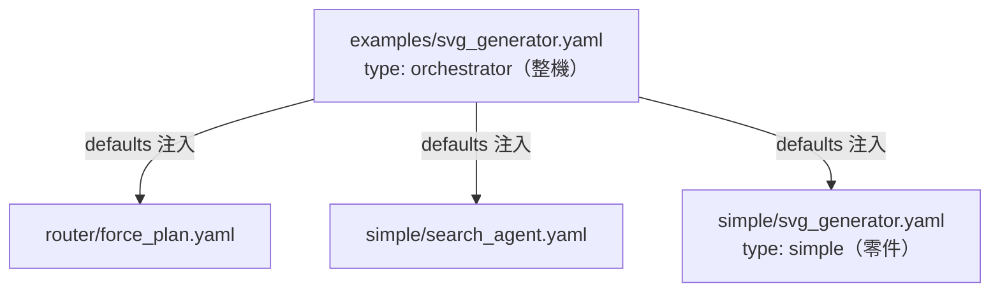
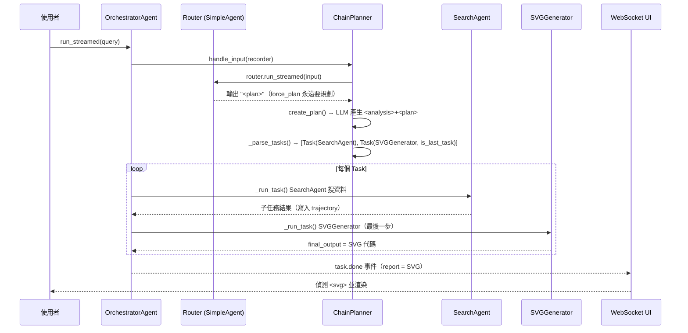
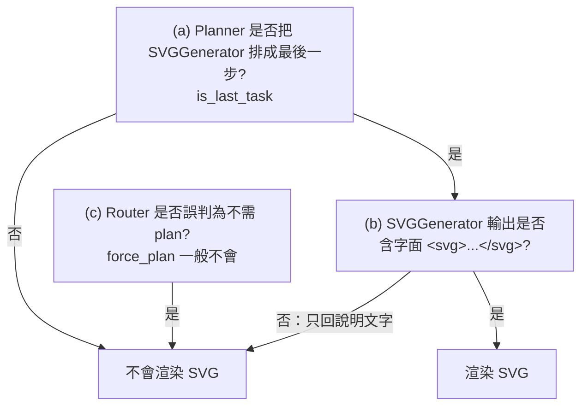
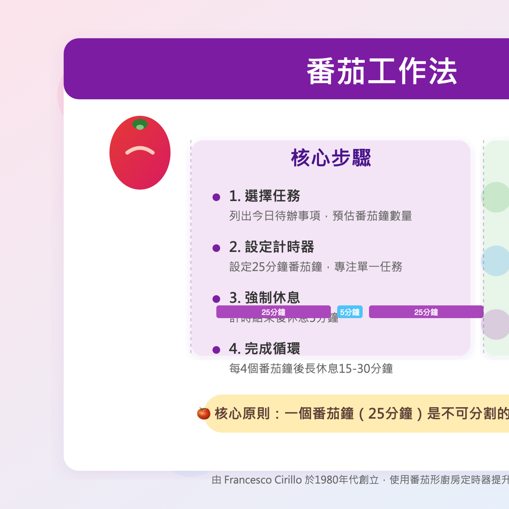

# SVG Generator 技術流文件（pgm-spec）

> 目的：以 **SVG Generator** 為範例，從 programming 角度把 NeurForge 的 agent
> 執行流講清楚——用到哪些技術、每一步對應哪段程式碼、為什麼這樣設計，
> 讓我們能對外教學、對內調優。
>
> 語言：zh-TW；英文技術名詞保留原文。
> 適用版本：`v0.1.0-baseline` 之後。
> 重要前提：真實程式碼都在 `utu/` 下，`neurforge/` 只是 forwarding shim
> （`neurforge.X` 與 `utu.X` 是同一個 module）。本文引用以 `utu/` 路徑為準。

---

## 0. 名詞速查（先看這個再往下讀）

| 名詞 | 一句話定義 |
| --- | --- |
| **Agent** | OpenAI Agents SDK 的最小單位：一個 LLM + instructions + tools。 |
| **SimpleAgent** | NeurForge 對單一 Agent 的封裝（`type: simple`）。 |
| **Orchestrator** | 不自己做事，負責「規劃 + 把子任務派給多個 SimpleAgent」（`type: orchestrator`）。 |
| **Worker / Sub-agent** | 被 orchestrator 呼叫去執行單一子任務的 SimpleAgent。 |
| **Router** | orchestrator 的進入點，判斷「要不要規劃」。 |
| **Planner（ChainPlanner）** | 把使用者問題拆成有序的 `Task` 串列。 |
| **Toolkit** | 一組工具的集合（`@register_tool` 標記、`AsyncBaseToolkit` 載入）。 |
| **Hydra config** | YAML 設定組裝系統，用 `defaults` 把零件拼成整機。 |

---

## 1. 一句話總覽 + 角色地圖

**SVG Generator（examples 版）是一個 orchestrator 多代理流程：使用者問問題 →
Router 判斷需要規劃 → Planner 產生計畫 → 依序呼叫 SearchAgent 搜資料、
SVGGenerator 把結果畫成 SVG 卡片 → 最後一個 worker 的輸出當作最終答案回傳前端。**

底層執行引擎是 **OpenAI Agents SDK**（不是 LangChain）。NeurForge 在它之上加了
config 組裝（Hydra）、tracing（Phoenix/OpenTelemetry）、串流 UI（Tornado WebSocket）。



角色與檔案對應：

| 角色 | 程式碼 |
| --- | --- |
| 進入點 / 串流 | [utu/agents/orchestrator_agent.py](../../utu/agents/orchestrator_agent.py) `OrchestratorAgent` |
| 規劃器 | [utu/agents/orchestrator/chain.py](../../utu/agents/orchestrator/chain.py) `ChainPlanner` |
| Worker 本體 | [utu/agents/simple_agent.py](../../utu/agents/simple_agent.py) `SimpleAgent` |
| Router 設定 | [configs/agents/router/force_plan.yaml](../../configs/agents/router/force_plan.yaml) |
| 整機設定 | [configs/agents/examples/svg_generator.yaml](../../configs/agents/examples/svg_generator.yaml) |
| 零件設定 | [configs/agents/simple/svg_generator.yaml](../../configs/agents/simple/svg_generator.yaml) |
| tracing | [utu/tracing/setup.py](../../utu/tracing/setup.py) |
| Web UI | [utu/ui/webui_agents.py](../../utu/ui/webui_agents.py) |

---

## 2. 兩套 config 目錄差異（simple vs examples）

NeurForge 的 agent 設定散在 `configs/agents/` 底下不同子目錄，**子目錄名稱本身不決定
行為，真正決定行為的是 YAML 裡的 `type` 欄位。** 但兩個目錄在「慣例」上分工明確：

| | `configs/agents/simple/` | `configs/agents/examples/` |
| --- | --- | --- |
| 典型 `type` | `simple` | `orchestrator`（多代理） |
| 概念 | **零件**：單一 Agent + 工具 | **整機**：規劃 + 分派多個零件 |
| 載入類別 | `SimpleAgent` | `OrchestratorAgent` |
| 能自己跑嗎 | 能 | 能（且會去呼叫 simple 零件） |
| 適用 | 單步驟任務（問答、產圖） | 多步驟任務（搜尋＋彙整＋產出） |

派工邏輯在 [utu/agents/\_\_init\_\_.py](../../utu/agents/__init__.py)，依 `config.type`
建立對應 agent 類別：

```python
def get_agent(config: AgentConfig):
    if config.type == "simple":
        return SimpleAgent(config=config)
    elif config.type == "orchestra":      # 舊、deprecated
        return OrchestraAgent(config=config)
    elif config.type == "orchestrator":   # 現行多代理
        return OrchestratorAgent(config=config)
    elif config.type == "workforce":
        return WorkforceAgent(config=config)
```

> 補充：`type` 共有四種。`orchestra`（舊）已 deprecated，現行多代理請用
> `orchestrator`。`workforce` 是另一條實驗路線。本文聚焦 `simple` 與 `orchestrator`。

### 2.1 Sidebar 的三色分類 ≠ 後端 type

Web UI 左側 `AVAILABLE CONFIGS` 的黃色 MULTI / 紫色 AGENT / 青色 MFG，是
**前端用「檔名/路徑關鍵字」歸類**，跟後端 `type` 不是同一回事。邏輯在
[frontend/webui/src/components/SideBar.tsx](../../frontend/webui/src/components/SideBar.tsx)：

```typescript
const MFG_KEYWORDS = ['sensor_sage', 'industrial_qa', 'case_detective'];
const MULTI_PATTERNS = ['examples/', 'orchestra', 'generated/'];

function getCategory(config: string): ConfigCategory {
  const key = config.toLowerCase();
  if (MFG_KEYWORDS.some(k => key.includes(k))) return 'manufacturing'; // 青色 MFG
  if (MULTI_PATTERNS.some(k => key.includes(k))) return 'multi';        // 黃色 MULTI
  return 'single';                                                       // 紫色 AGENT
}
```

關鍵理解：

- 一個檔案落在 `examples/` → 前端標 **MULTI**（黃色），即使它技術上並非每個都是多代理。
- 三個工業 agent 因檔名含關鍵字 → 被攔成 **MFG**（青色），即使它們其實是 `type: simple`。
- 其餘（多數 `simple/`）→ **AGENT**（紫色）。

所以「黃色 MULTI / 紫色 AGENT」的真正來源是**前端路徑分類**，不是後端 agent 種類。
這也是你當初「先把兩個目錄分開」的視覺化結果。

---

## 3. 為什麼 SVG Generator 有兩份 config

SVG Generator 同時存在於兩個目錄，**不是重複實作，而是「整機」重用「零件」**：

### 3.1 整機（examples，orchestrator）

[configs/agents/examples/svg_generator.yaml](../../configs/agents/examples/svg_generator.yaml)：

```yaml
# @package _global_
defaults:
  - /model/base@orchestrator_model
  - /agents/router/force_plan@orchestrator_router                 # router 零件
  - /agents/simple/search_agent@orchestrator_workers.SearchAgent  # 搜尋零件
  - /agents/simple/svg_generator@orchestrator_workers.SVGGenerator # 畫圖零件
  - _self_

type: orchestrator

orchestrator_config:
  name: SVGGeneratorAgent
  add_chitchat_subagent: false
  additional_instructions: |-
    ... 先 clarify → 再 SearchAgent → 最後 SVGGenerator 產出 ...
```

注意 `defaults` 裡的 `@orchestrator_workers.SVGGenerator`：這是 Hydra 的語法，
意思是「把 `simple/svg_generator.yaml` 整份塞進 `orchestrator_workers` 字典，key 叫
`SVGGenerator`」。零件就是這樣被組裝進整機的。

### 3.2 零件（simple，type: simple）

[configs/agents/simple/svg_generator.yaml](../../configs/agents/simple/svg_generator.yaml)
只定義「怎麼畫 SVG」這一件事（純 instructions，沒有 toolkit）：

```yaml
# @package _global_
defaults:
  - /model/base@model
  - _self_

agent:
  name: SVGGenerator
  instructions: |-
    Create an exquisite SVG card ...
    - Dimensions: 1200x800px ...
    - Format Output: Complete SVG code without errors
```

### 3.3 結論



- **simple 版**：可單獨跑（給它指令直接吐 SVG），也可被當 worker。
- **examples 版**：先 plan、可先搜尋再產出，把 simple 版當最後一步。

---

## 4. 端到端執行流程（逐步對應程式碼）



### 4.1 進入點與串流

[utu/agents/orchestrator_agent.py](../../utu/agents/orchestrator_agent.py)
`OrchestratorAgent._start_streaming`：

```python
async def _start_streaming(self, recorder: Recorder):
    with trace(workflow_name=self.name, trace_id=recorder.trace_id):  # tracing 範圍
        planner = await self.orchestrator.handle_input(recorder)      # 1) 規劃
        if planner:  # 有計畫
            while True:
                task = await self.orchestrator.get_next_task(recorder)
                await self._run_task(recorder, task)                  # 2) 逐一執行
                if task.is_last_task:
                    recorder.add_final_output(task.result)            # 3) 最後一步當最終答案
                    break
```

整個流程用 `asyncio` + event queue 串流，事件透過 `recorder.stream_events()`
往外吐，UI 端逐一消費（見 §5.4）。

### 4.2 規劃（Router → Planner）

[utu/agents/orchestrator/chain.py](../../utu/agents/orchestrator/chain.py)
`ChainPlanner.handle_input`：

```python
async def handle_input(self, recorder) -> None | Plan:
    async with self.router as router:
        res = router.run_streamed(input)
        await self._process_streamed(res, recorder)
    need_plan = res.final_output.strip().endswith("<plan>")  # 特殊 token！
    if need_plan:
        return await self.create_plan(recorder)
```

- **Router** 是一個 SimpleAgent，設定見
  [configs/agents/router/force_plan.yaml](../../configs/agents/router/force_plan.yaml)：
  它被指示「永遠只回 `<plan>`」，所以 SVG Generator 一定會進入規劃。
  （對照 [configs/agents/router/base.yaml](../../configs/agents/router/base.yaml)：
  簡單任務可自己用 Python/Search 解，不一定規劃——這就是 force_plan 與 base 的差別。）

- **Planner** `create_plan` 用 few-shot 範例 + jinja 模板組 system prompt，叫 LLM 輸出
  `<analysis>...</analysis><plan>[{"name","task"}...]</plan>`，再解析。

### 4.3 容錯解析（plan parser）

LLM 輸出常有雜訊（全形引號、markdown fence、多餘空白），`_parse_tasks` 做多層防禦：

```python
def _parse_tasks(self, text):
    block = self._extract_plan_block(text)   # 抓 <plan> 內的 JSON array，去掉 ```json fence
    if block is None: return []
    block = block.translate(self._QUOTE_NORMALIZE)  # 全形/智慧引號 → ASCII "
    tasks = self._tasks_from_json(block)     # 1) 優先 JSON parse（容忍 key 順序/多餘欄位）
    if tasks: return tasks
    return self._tasks_from_regex(block)     # 2) fallback：regex（也接受 agent_name key）
```

解析不到任何 task 會丟 `ValueError` 並把原始輸出寫進 log，方便排錯。
最後一個 task 會被標 `is_last_task = True`（`Plan` 建構於 `_parse`）。

### 4.4 執行 Worker（Sub-agent）

`OrchestratorAgent._run_task`：

```python
async def _run_task(self, recorder, task):
    worker = self.workers[task.agent_name]   # 依 name 找對應 SimpleAgent
    await worker.build()
    task_with_context = render(PROMPTS["worker"], problem=..., plan=..., trajectory=..., task=task)
    result = worker.run_streamed(input)      # 跑這個 worker
    async for event in result.stream_events():
        recorder._event_queue.put_nowait(event)  # 串流轉發
    task.result = result.final_output        # 子任務結果
```

worker prompt（[utu/prompts/agents/orchestrator/chain.yaml](../../utu/prompts/agents/orchestrator/chain.yaml)
的 `worker`）會告訴最後一個 worker：「你的輸出就是最終答案」。對 SVGGenerator 而言，
這代表它必須直接吐出可渲染的 SVG 代碼。

---

## 5. 技術棧逐項說明

### 5.1 OpenAI Agents SDK（核心執行引擎，非 LangChain）

NeurForge 的 agent 不是自己寫的 runtime，而是包在
[`openai-agents`](https://github.com/openai/openai-agents-python) 之上。
`SimpleAgent.build()` 直接建立 SDK 的 `Agent`：

```python
self.current_agent = Agent(
    name=self.config.agent.name,
    instructions=self.config.agent.instructions,
    model=self.model,
    model_settings=self.model_settings,
    tools=tools,
    output_type=self.output_type,
    tool_use_behavior=self.tool_use_behavior,   # run_llm_again / StopAtTools
    mcp_servers=self._mcp_servers,
)
```

執行則包 SDK 的 `Runner`（`run` / `run_streamed`）。串流時逐一吐出 SDK 事件
（`RawResponsesStreamEvent`、`RunItemStreamEvent`、`AgentUpdatedStreamEvent`）。
`trace(...)` 也是 SDK 提供的 tracing context。

> 教學重點：**Multi-agent 不靠任何 graph framework**。orchestrator 只是一段 Python
> while loop，逐一呼叫各個 SDK Agent，並用 `recorder` 串接彼此的 context/trajectory。

### 5.2 Hydra / OmegaConf（config 組裝）

每個 YAML 開頭 `# @package _global_` + `defaults` 清單，把「零件設定」組成「整機設定」。
語法 `/agents/simple/svg_generator@orchestrator_workers.SVGGenerator` 代表
「載入該檔，掛到 `orchestrator_workers.SVGGenerator` 這個位置」。
載入由 `ConfigLoader.load_agent_config(name)` 完成（見 `SimpleAgent._get_config`）。

好處：加一個新 worker 不用改 Python，只要在 `defaults` 多一行。

### 5.3 Phoenix / OpenTelemetry（tracing，可選）

[utu/tracing/setup.py](../../utu/tracing/setup.py) 用
[OpenInference](https://github.com/Arize-ai/openinference) 的 instrumentor 把 Agents SDK
的每一步轉成 OTel span，經 OTLP exporter 送到 Phoenix：

```python
def setup_otel_tracing(...):
    endpoint = endpoint or EnvUtils.get_env("PHOENIX_ENDPOINT", "")
    project_name = project_name or EnvUtils.get_env("PHOENIX_PROJECT_NAME", "")
    if not endpoint or not project_name:
        set_tracing_disabled(True)   # 沒設環境變數 → 直接關閉 tracing
        return
    OpenAIInstrumentor().instrument(tracer_provider=OTEL_TRACING_PROVIDER)
    _UTUAgentsInstrumentor().instrument(...)   # 注入 trace_id 到 Phoenix metadata
```

- 啟用條件：`.env` 設 `PHOENIX_ENDPOINT` + `PHOENIX_PROJECT_NAME`（雲端版另需
  `PHOENIX_API_KEY`）。沒設就**自動停用**，不影響執行。
- 另有 `setup_db_tracing()`：若設了 `UTU_DB_URL`，trajectory 會寫進 DB。

> 注意：本 repo **目前沒有 critic / critics 機制**（無自我評分或重試評審環節）。
> 品質完全取決於各 agent 的 instructions 與模型本身。若未來要做 critic，會是
> 「在 `_run_task` 後加一個評審 agent + 不滿意則 replan」——目前尚未實作。

### 5.4 Tornado WebSocket UI（串流前端）

[utu/ui/webui_agents.py](../../utu/ui/webui_agents.py) 的 `WebSocketHandler`
把 agent 串流事件轉成前端事件。對 orchestrator：

```python
elif isinstance(self.agent, OrchestratorAgent):
    stream = self.agent.run_streamed(query.query, self.history)
    self.history = stream   # 保留多輪 chat 的 recorder

async for event in stream.stream_events():
    if isinstance(event, OrchestratorStreamEvent):
        event_to_send = await handle_orchestrator_events(event)   # plan/task 事件
    elif isinstance(event, ag.RawResponsesStreamEvent):
        event_to_send = await handle_raw_stream_events(event)     # token 串流
    ...
```

`handle_orchestrator_events`（[utu/ui/common.py](../../utu/ui/common.py)）會把最後一步
（`is_last_task`）的 `task.done` 事件標成 `is_reporter=True`，並把 `task.result`
當作 `report` 送給前端——**這份 report 就是前端判斷要不要渲染 SVG 的內容**（見 §9）。

### 5.5 Tools / Toolkit（本範例未用，但需理解）

SVG Generator 的兩個 worker 都沒有外部工具（純文字生成），但其他 agent 會用到。
工具系統重點（詳見 `AGENTS.md` 與 `CLAUDE.md` §10）：

- 用 `@register_tool`（`utu/tools/utils.py`）標記方法，`AsyncBaseToolkit.tools_map`
  才認得；**不要用 SDK 的 `@function_tool`**，那個不會被 toolkit 載入。
- Toolkit `__init__` 簽名必須是 `def __init__(self, config=None)`。
- config 用 `mode: customized / builtin / mcp` 決定載入方式（見
  `SimpleAgent._load_toolkit`）。

---

## 6. Multi-Agent vs Sub-agent vs Single Agent

| 概念 | 是什麼 | 怎麼做到的 | 何時用 |
| --- | --- | --- | --- |
| **Single Agent** | 一個 SimpleAgent（LLM + tools） | SDK `Agent` + `Runner` | 單步驟：問答、單次產圖 |
| **Multi-Agent** | 一個 Orchestrator 串多個 SimpleAgent | Python while loop 依 `Plan` 逐一呼叫 worker | 多步驟：搜尋＋彙整＋產出 |
| **Sub-agent / Worker** | Multi-Agent 裡被呼叫的那些 SimpleAgent | `OrchestratorAgent.workers[name]` | 每個負責計畫中的一個 `Task` |

關鍵實作事實（教學/募資時要講清楚）：

1. **沒有用 LangChain / LangGraph**。Multi-agent 的「編排」就是
   [orchestrator_agent.py](../../utu/agents/orchestrator_agent.py) 的一段 async 迴圈，
   執行引擎是 **OpenAI Agents SDK**。
2. **Sub-agent 必須是 `type: simple`**。`_setup_workers` 有斷言：
   ```python
   assert config.type == "simple", "Only support SimpleAgent as worker in orchestra agent"
   ```
   也就是 orchestrator 不能巢狀 orchestrator（目前）。
3. **資訊如何在 sub-agent 間傳遞**：靠 `Recorder` 累積 `trajectory`，下一個 worker 的
   prompt 會帶上「原問題 + 整體計畫 + 先前步驟輸出」（worker prompt 模板）。
4. **可選的 ChitchatAgent**：`add_chitchat_subagent`（預設 `True`，SVG 設成 `False`）。
   開啟時 orchestrator 會自動多注入一個閒聊 worker（`_handle_config`）。

---

## 7. Smart Manufacturing 加在哪 + 要不要做兩套

### 7.1 你把三個工業 agent 加在 `simple/`

| Agent | config | type | 工具 |
| --- | --- | --- | --- |
| 機況先知 SensorSage | [configs/agents/simple/sensor_sage_agent.yaml](../../configs/agents/simple/sensor_sage_agent.yaml) | simple | `examples/sensor_sage/tools/*` customized toolkit |
| 廠務通 IndustrialQA | [configs/agents/simple/industrial_qa_agent.yaml](../../configs/agents/simple/industrial_qa_agent.yaml) | simple | customized toolkit |
| 案件偵探 CaseDetective | [configs/agents/simple/case_detective_agent.yaml](../../configs/agents/simple/case_detective_agent.yaml) | simple | customized toolkit |

- 它們**都是 `type: simple`**（單代理 + 工具），不是 orchestrator。
- 但因檔名含 `sensor_sage` / `industrial_qa` / `case_detective`，被 Sidebar 的
  `MFG_KEYWORDS` 攔截，歸到青色 **Smart Manufacturing**（§2.1）。
- 對照：sensor_sage 用 `defaults: - /tools/sensor_sage@toolkits.sensor_sage` 掛工具，
  而 SVG 零件沒有工具——這就是「有工具的單代理」vs「純生成單代理」的差別。

### 7.2 simple 與 examples 能不能各做一套？為什麼要兩套？

能。決策依任務步驟數：

| 你的需求 | 用哪種 | 範例 |
| --- | --- | --- |
| 單步驟、資料已在工具裡、直接回答/產出 | **simple** | sensor_sage 查心跳快照後直接診斷 |
| 多步驟、要先搜尋/彙整、再產出結構化結果 | **examples / orchestrator** | SVG Generator：先 SearchAgent 再 SVGGenerator |

何時值得做「兩套」：當同一場景**既有快速單代理版、又有完整多步驟版**時。
SVG Generator 正是如此——simple 版適合「我已給你內容，純畫圖」；orchestrator 版適合
「給我一個主題，幫我查資料再畫成卡片」。**多數情況只需要一套**：先用 simple，
等確定要多步驟編排再升級成 orchestrator（把現有 simple 當 worker 重用）。

---

## 8. 如何試用

### 8.1 前置

```bash
uv sync
cp .env.example .env        # 填 NEURFORGE_LLM_API_KEY=<你的 key>
```

### 8.2 CLI（最快，看終端串流）

```bash
# orchestrator 整機
uv run python scripts/cli_chat.py --config examples/svg_generator

# 或直接跑範例腳本
uv run --env-file .env python examples/svg_generator/main.py
```

### 8.3 Web UI（看實際 SVG 渲染）

```bash
uv run --env-file .env python examples/svg_generator/main_web.py
# 開 http://127.0.0.1:8848/index.html
```

預設問題（`main_web.py`）：「2025 年台灣智慧製造導入 AI Agent 的三個關鍵應用場景與效益」。

### 8.4 單代理（simple 零件）單獨試

```bash
uv run python scripts/cli_chat.py --config simple/svg_generator
# 直接貼一段內容，請它畫成 SVG
```

---

## 9. 排錯：SVG 有時畫不出來（「看心情」的真相）

### 9.1 前端怎麼決定要不要畫 SVG

[frontend/webui/src/components/MessageComponent.tsx](../../frontend/webui/src/components/MessageComponent.tsx)
`postprocessReportContent` 對**最終 report 內容**做正則比對：

```typescript
// test if it is svg
if (/<svg(.*)<\/svg>/s.test(processedContent)) {
  contentType = "svg";
  const match = processedContent.match(/<svg(.*)<\/svg>/s);
  processedContent = "<svg" + match[1] + "</svg>";
  return { content: processedContent, contentType };
}
// 否則當 markdown
```

命中（含字面 `<svg>...</svg>`）才會用 `dangerouslySetInnerHTML` 真的渲染圖；
否則整段被當 markdown 純文字顯示——這就是「沒畫出來」的直接原因。

### 9.2 三個非決定性環節（任何一個失手就畫不出來）



- **(a) 計畫順序**：Planner 是 LLM，輸出有隨機性。若它把 SearchAgent 排在最後、或
  只排一個搜尋 task，最終 `final_output` 就不是 SVG。
- **(b) 輸出格式**：SVGGenerator 偶爾會回「我建議的設計是…」這類說明、或把 SVG 用
  非預期格式包住，導致 report 裡沒有字面 `<svg>`。
- **(c) Router 判斷**：本範例用 `force_plan`（永遠規劃），這條通常不會失手；但若改用
  `base` router 就可能跳過規劃。

**結論：所謂「看心情」＝ LLM 取樣隨機性**（temperature）疊加上述環節，不是 bug。

### 9.3 排查順序（從便宜到貴）

1. 看終端/Phoenix 的 `plan.done` 事件：SVGGenerator 是不是最後一個 task？
   - 不是 → 問題在 §9.2(a)，往 §9.4 調 planner。
2. 看最後一步 worker 的 `final_output` 原文：有沒有 `<svg`？
   - 沒有 → 問題在 §9.2(b)，往 §9.4 強化 SVGGenerator instructions。
3. 兩者都對但前端仍不畫 → 檢查 report 是否被別的文字包住（正則 `<svg(.*)</svg>` 是
   greedy，理論上能跨段抓取，但若根本沒有 `<svg` 字面就會落回 markdown）。

### 9.4 可調手段（穩定產出 SVG）

不改執行引擎，只調 config/prompt（低風險）：

- **降溫**：把 model `temperature` 調低（`configs/model/base.yaml` 或對應 model 設定），
  減少 planner / 生成的隨機性。
- **強化整機 instructions**：在
  [configs/agents/examples/svg_generator.yaml](../../configs/agents/examples/svg_generator.yaml)
  的 `additional_instructions` 明確要求「**計畫的最後一步必須是 SVGGenerator**，且其
  輸出必須是純 `<svg>...</svg>` 代碼，不得包含其他說明文字」。
- **強化零件 instructions**：在
  [configs/agents/simple/svg_generator.yaml](../../configs/agents/simple/svg_generator.yaml)
  明確規定「只輸出 `<svg>` 開頭、`</svg>` 結尾的完整代碼，不要 markdown fence、不要前後說明」。
- **驗證提示**：可在 `additional_instructions` 加「輸出前自我檢查是否以 `<svg` 開頭」。

> 進階（需改程式、超出本文範圍）：在 `_run_task` 後加一個輕量 validator，偵測最後一步
> 不含 `<svg` 時自動重跑該 worker——這等於引入 §5.3 提到、目前尚未存在的 critic 機制。

---

## 9.5 實測紀錄（2026-05-30，第一輪）

實際跑 `examples/svg_generator`（orchestrator）一輪，固定題目（已寫進
[examples/svg_generator/main.py](../../examples/svg_generator/main.py) 與
[main_web.py](../../examples/svg_generator/main_web.py)）：

> 題目：用一張 SVG 資訊卡，介紹「番茄工作法（Pomodoro Technique）」的核心步驟與三個好處。

| 觀測項 | 結果 |
| --- | --- |
| 執行時間 | ~306 秒（含一次 SearchAgent 網路搜尋 + SVG 生成） |
| 計畫（plan） | `[(SearchAgent, last=False), (SVGGenerator, last=True)]` ← 與設計完全一致 |
| 最終輸出長度 | 7150 字元 |
| 含字面 `<svg>...</svg>` | ✅ 是（§9.1 的正則命中 → Web UI 會渲染） |
| 最終答案開頭 | `<?xml version="1.0" ...><svg width="1200" height="800" ...>` |

產出（修正下述瑕疵後的乾淨渲染；原始檔見
[examples/svg_generator/data/pomodoro_card.svg](../../examples/svg_generator/data/pomodoro_card.svg)）：



### 本輪揭露的真實瑕疵（極佳教學點）

1. **重複屬性（duplicate attribute）**：LLM 在第 32 行產出
   `<rect ... rx="24" rx="24" .../>`，同一屬性寫了兩次。
   - 用**嚴格 XML parser**（macOS `qlmanage`、瀏覽器的 XML 模式、SVG 驗證器）會直接
     報錯 `Attribute rx redefined` 並停止渲染。
   - 但 Web UI 走的是 `dangerouslySetInnerHTML`（**HTML 寬鬆解析**），會忽略重複屬性、
     照常畫出來。
   - 這正好補充 §9：**「HAS_SVG=true 且在瀏覽器畫得出來」不代表 SVG 合法**。若把同一份
     輸出丟到嚴格環境（存檔、轉 PNG、其他平台）就可能「畫不出來」。這也是「看心情」的
     另一個面向——模型偶發的語法雜訊。
2. **版面/viewport 溢出**：卡片設計為 1200×800，右側「三大好處」區塊與時間軸（25/5 分鐘
   bar）位置偶有重疊、超出可視範圍。屬模型版面估算誤差，非框架問題。
3. **圖示細節**：番茄上的「微笑」曲線方向畫反（成了嘴角下垂）。同屬生成隨機性。

### 對調優的啟示（呼應 §9.4）

- 若要產出「嚴格合法」的 SVG，可在
  [configs/agents/simple/svg_generator.yaml](../../configs/agents/simple/svg_generator.yaml)
  的 instructions 增加：「不得重複任何 XML 屬性；所有元素必須落在 0 0 1200 800 範圍內；
  輸出前自我檢查屬性唯一性」。
- 進階：在 `_run_task` 後加一個 SVG validator（解析 XML，失敗則要求重生）——即 §5.3 提到、
  目前尚未實作的 runtime critic。

> 結論：本輪 **plan 正確、最後一步為 SVGGenerator、確實畫出卡片**。所謂「上次畫得出、這次
> 畫不出」的隨機性，根因就是 §9.2 的三個環節 + 本節揭露的「輸出語法瑕疵在不同渲染器下表現
> 不同」。

---

## 10. 後續：各 agent 試用紀錄模板

每試一個 agent，複製下面這塊填寫，逐步把整個平台摸熟。

```markdown
### Agent：<config 路徑，例 examples/svg_generator>
- type：<simple / orchestrator>
- 啟動方式：<CLI 指令 / Web>
- 測試問題：
- 預期行為：
- 實際結果：
- 是否正常產出（SVG/報告/答案）：是 / 否
- 若異常，落在 §9.2 哪一環：(a) / (b) / (c) / 其他
- 調整動作：
- 結論：
```

建議先試順序：

1. `simple/svg_generator`（純零件，最單純）
2. `examples/svg_generator`（整機，驗證多代理流程）
3. `simple/sensor_sage_agent`（帶 customized toolkit 的單代理）
4. 其餘 `simple/*` 與 `examples/*` 逐一比對行為。

---

### 附錄：本文引用的關鍵檔案

| 主題 | 檔案 |
| --- | --- |
| Orchestrator 主流程 | [utu/agents/orchestrator_agent.py](../../utu/agents/orchestrator_agent.py) |
| 規劃器 / plan parser | [utu/agents/orchestrator/chain.py](../../utu/agents/orchestrator/chain.py) |
| 資料結構（Task/Plan/Recorder） | [utu/agents/orchestrator/common.py](../../utu/agents/orchestrator/common.py) |
| SimpleAgent | [utu/agents/simple_agent.py](../../utu/agents/simple_agent.py) |
| agent 派工 | [utu/agents/\_\_init\_\_.py](../../utu/agents/__init__.py) |
| prompts | [utu/prompts/agents/orchestrator/chain.yaml](../../utu/prompts/agents/orchestrator/chain.yaml) |
| tracing | [utu/tracing/setup.py](../../utu/tracing/setup.py) |
| Web UI 後端 | [utu/ui/webui_agents.py](../../utu/ui/webui_agents.py) |
| Web UI 事件 / report | [utu/ui/common.py](../../utu/ui/common.py) |
| 前端 SVG 渲染 | [frontend/webui/src/components/MessageComponent.tsx](../../frontend/webui/src/components/MessageComponent.tsx) |
| 前端分類 | [frontend/webui/src/components/SideBar.tsx](../../frontend/webui/src/components/SideBar.tsx) |
| 整機 config | [configs/agents/examples/svg_generator.yaml](../../configs/agents/examples/svg_generator.yaml) |
| 零件 config | [configs/agents/simple/svg_generator.yaml](../../configs/agents/simple/svg_generator.yaml) |
| Router | [configs/agents/router/force_plan.yaml](../../configs/agents/router/force_plan.yaml) |
